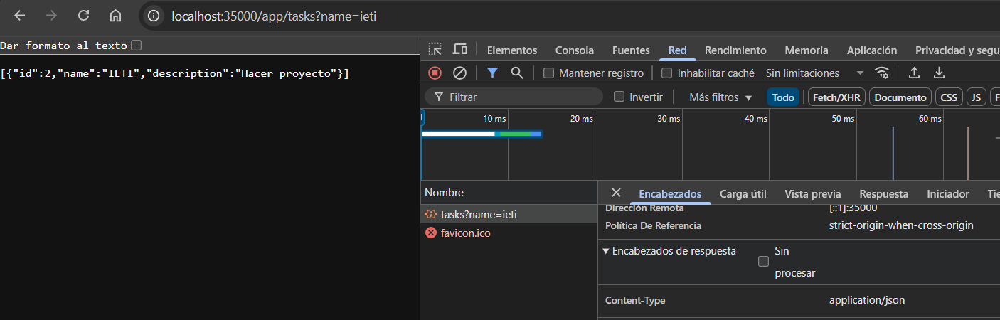

# Desarrollo de un marco web para servicios REST y gestión de archivos estáticos

## Introducción

En este proyecto se tiene como propósito mejorar un servidor **HTTP** básico que, anteriormente, solo permitía
servir archivos estáticos **HTML, CSS, Javascript e imágenes**, además de manejar métodos **GET** y **POST** definidos directamente en el código fuente. 

El objetivo principal es evolucionar este servidor hacia un pequeño framework web que facilite el desarrollo
de aplicaciones con servicios REST. Para lograrlo, se implementa un mecanismo que permite a los desarrolladores:

* Definir endpoints mediante **funciones lambda**, empezando, por el momento, con el metodo **GET**.
* Gestionar de forma sencilla la entrada y salida de las solicitudes HTTP.
* Especificar la ubicación de **archivos estáticos** de la aplicación.

Así, se obtiene un framework web completamente funcional para construir aplicaciones web personalizadas. 

## Arquitectura
La siguiente figura muestra el **diagrama de clases** que representa la estructura interna del servidor web.  
En él se ilustran los componentes principales, sus responsabilidades y las relaciones entre ellos.


### Service 
Interfaz funcional que permite registrar y ejecutar funciones lambda asociadas a rutas específicas. 
Cada servicio recibe un objeto `HttpRequest` (entrada) y un objeto `HttpResponse` (salida), 
y devuelve una respuesta que será enviada al cliente.
### HttpRequest
Encapsula la información de la solicitud HTTP recibida. Gestiona la URI y los parámetros de consulta (`query params`).
### HttpResponse
Modela la respuesta HTTP que será enviada al cliente, se encarga de tener el estado y código de respuesta HTTP (`200 OK`,`400 Bad Request`,etc.),
los encabezados (`Content-Type`,`Content-Lenght`, etc) y el cuerpo a enviar.
### HttpServer
Es el núcleo del framework, se encarga principalmente de:

* Registrar servicios mediante el método `get(route, service)`.

* Manejar la ejecución de las lambdas definidas por el desarrollador.

* Servir archivos estáticos (HTML, CSS, JS, imágenes) desde un directorio configurado mediante `staticfiles(path)`.

* Procesar las solicitudes HTTP entrantes (`manageRequest(...)`) y construir la respuesta final.

* Gestionar errores comunes (400,404, 500, 405) y generar respuestas acordes.

## Primeros Pasos

### Prerrequisitos

Antes de comenzar, es necesario tener instalado lo siguiente en el entorno:

* **Java Development Kit (JDK) 21 o superior**

  [Descargar JDK](https://www.oracle.com/java/technologies/javase/jdk21-archive-downloads.html)

  Verifica la versión

    ```
    java -version
    ```
* **Maven**

  Construcción de gestión de dependencias -
  [Instalar Maven](https://maven.apache.org/download.cgi)

  Verifica la instalación 

    ```
    mvn -version
    ```

* **Git**

  Control de versiones -
  [Descargar Git](https://git-scm.com/downloads)

  Verifica la instalación

    ```
    git -version
    ```

### Instalación

1. Clonar el repositorio
    ```
    git clone https://github.com/CamilaTorres08/Taller2_AREP.git
    cd Taller2_AREP
    ```
2. Compilar el proyecto
    ```
    mvn clean install
    ```
3. Ejecutar el servidor
    ```
    mvn exec:java
    ```
   O directamente en la IDE dando click en *Run* sobre el archivo `Main`

4. Abrir la aplicación en el navegador
    ```
    http://localhost:35000
    ```

## Funcionamiento

El framework permite definir endpoints de manera sencilla utilizando funciones lambda. 
Cada endpoint se registra antes de iniciar el servidor mediante el método `get(...)`, 
el cual asocia una ruta con la lógica que debe ejecutarse.

### Definición de endpoints
Para registrar un nuevo endpoint, use la siguiente estructura:
```
get("[nombre del endpoint]", (request, response) -> {
    ...logica a ejecutar
});
```
*Nota: Es necesario que la función lambda reciba dos parámetros `request` y `response` ya que estos gestionan la entrada y salida de la solicitud.*

#### Acceso a los parámetros de la solicitud
Si el endpoint recibe parámetros en la URL (`query params`), se pueden obtener con:

```
request.getValues([nombre del parámetro])
```
Ejemplo: 

supongamos que el endpoint es `/prueba?name=Camila`
```
request.getValues(name) //resultado: Camila
```
#### Contrucción de la respuesta
Para devolver la respuesta del endpoint use el parámetro `response`, en el puede usar los siguientes metodos:

* **Codigo de estado (status code)**
    ```
    response.status([codigo])
    ```
  *Nota: En caso de no asignar codigo de respuesta, automaticamente se asignará **200 OK**. 
    Si no se define status ni body, se devuelve **204 No Content.***

* **Encabezados (headers)**

    Para agregar encabezados personalizados:

    ```
    response.header([nombre del header],[valor])
    ```
  Es obligatorio que el encabezado incluya `Content-Type`, use lo siguiente para asignar el valor de este:

    ```
    response.contentType([valor])
    ```
  En caso de no asignar el encabezado `Content-Type`, automáticamente se asignará un valor por defecto,
    dependiendo de que tipo sea el cuerpo (`body`):
    * `String` o no se especifica -> `text/plain`
    * `Objeto` -> `application/json` 
    * `Bytes` -> `application/octet-stream`

* **Cuerpo (body)**

    Es opcional, puede definirse como:
     ```
    response.body([objeto])
    ```
  *Nota: El body puede ser de tipo String, Listas (`List<>`), Objetos (Como una clase) y bytes (`byte[]`)*

#### Ejemplo Completo

    get("/prueba", (request, response) -> {
        //Obtiene el valor del parametro
        String param = request.getValues("case");
        if(param == null){
            //Retorna 400 Bad Request, Content-Type: text/plain, body: No se encontro parametro
            return response.status(400).body("No se encontró parametro");
        }
        if(param.equals("ok")){
            //Retorna 200 OK, Content-Type: text/html, Header personalizado, body: Operación exitosa
            return response.body("Operacion exitosa").contentType("text/html").header("X-Custom", "LambdaOK");
        }
        else if(param.equals("object")){
            List<Integer> list = List.of(1, 2, 3, 4, 5);
            //Retorna 200 OK, Content-Type: application/json, body: [1,2,3,4,5]
            return response.body(list);
        }
        //Retorna 204 No Content, Content-Type: text/plain
        return response;
    })


## Pruebas
### Pruebas manuales
Para la ejecución de estas pruebas, se definieron las lambdas que puede observar más a detalle en el archivo `Main`:
* `staticfiles`: Verificamos si se asignó correctamente el directorio para guardar los archivos estáticos
`http://localhost:35000/index.html`

`http://localhost:35000/styles/style.css`

`http://localhost:35000/scripts/script.js`

`http://localhost:35000/images/logo.png`

Obtener un archivo que no existe: `http://localhost:35000/images/hola.html`

* `/hello`: Retorna un saludo pasandole como parametro el nombre de la persona a saludar, en caso de que no haya parametros,
se devuelve un mensaje *hello world!*
Abrimos el navegador y escribimos `http://localhost:35000/app/hello`
  
`http://localhost:35000/app/hello?name=Camila`
  

* `/pi`: Retorna el valor de Pi

  `http://localhost:35000/app/pi`
  

* `/tasks`: Se construyó una aplicación web que agrega y busca tareas por el nombre,
por lo que al hacer click en el buscador de la app, se usa `http://localhost:35000/app/tasks?filter=[value]`

    `http://localhost:35000/app/tasks?filter=All`
    
  `http://localhost:35000/app/tasks?filter=arep`
    
  Probando directamente en el navegador
    
  Mandando un parámetro no válido
    

* `/numbers`: Retorna los primeros n números en una lista 
`http://localhost:35000/app/numbers`
  

* Solicitar un endpoint que no se creó
  `http://localhost:35000/app/prueba`
  

### Pruebas automáticas
  Se incluye pruebas con JUnit para validar el funcionamiento del framework.
  El archivo de pruebas se encuentra en: 

`src\test\java\edu\eci\arep\webserver\taller1_arep\HttpServerTests.java`

#### Ejecución de pruebas

* **Usando Maven**

    Ejecute todas las pruebas con el siguiente comando:
    ```
    mvn test
    ```
* **Usando la IDE**
    
    Abra el archivo `HttpServerTests` y ejecute directamente las pruebas con el botón *Run Test*
#### Endpoints de prueba 
Al iniciar las pruebas se registran endpoints temporales para cubrir distintos casos:

* `/json`: devuelve un objeto para verificar serialización a JSON y `Content-Type` definido explicitamente.

* `/square`: requiere el parámetro n y valida parámetros obligatorios

  * GET `/app/square?n=5` → `200 OK` con resultado

  * GET `/app/square (sin n)` → `400 Bad Request`

* `/status`: responde con un mensaje y el header automático `text/plain`.

* `/empty`: devuelve `null` para confirmar `204 No Content`.

* `/emptyBody`: no establece body explícito para comprobar comportamiento por defecto.

Así mismo se definió el endpoint `/tasks` explicado anteriormente, para evaluar el funcionamiento 
de la aplicación de tareas.

#### Verificación
Estas pruebas evalúan:
* **Asignación automática de `Content-Type`**

* **Códigos de estado HTTP**: `200 OK`, `400 Bad Request`, `404 Not Found`, `204 No Content`, `500 Internal Server Error`.

* **Construcción correcta de headers**: `Content-Type`, `Content-Length`, etc.

* **Archivos estáticos**: verificación de que se sirven desde el directorio configurado y manejo de “no encontrado”.

Así, se garantiza que el framework responde coherentemente a diferentes escenarios.


## Despliegue

Este proyecto está previsto para ejecutarse localmente con fines de desarrollo y pruebas.

## Tecnologías utilizadas

* [Java 21](https://openjdk.org/projects/jdk/21/) - Lenguaje de Programación
* [Maven](https://maven.apache.org/) - Compilaciones y dependencias
* [JUnit](https://junit.org/) - Framework de testeo

## Versionamiento

Actualmente se encuentra en desarrollo y se usa la versión por defecto.

## Autores

* **Andrea Camila Torres González** 

## Licencia

Este proyecto no cuenta actualmente con una licencia específica.  
Su uso está restringido únicamente a fines académicos.


